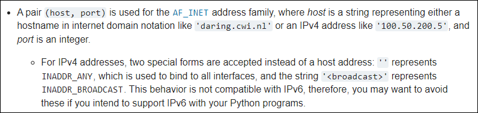
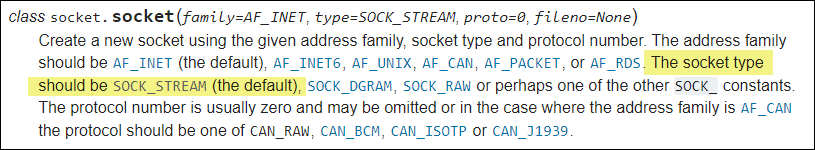
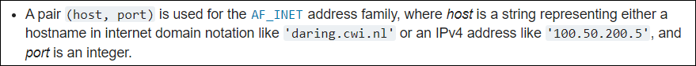

# Black Hat Python - Chapter 2

## Overview
When you are attacking a network, you may find that you don't have access to tools, like Wireshark, netcat, and a compiler.  However, in many cases Python will be installed, so that's where the value of knowing Python comes into play.

In this chapter, I will create clients, servers, and a TCP proxy.  I'll also create my very own netcat implementation, complete with a command shell.

This chapter is the foundation for subsequent chapters, in which I'll build a host discovery tool, implement cross-platform sniffers, and create a remote trojan framework!

This chapter uses the socket module.
- [https://docs.python.org/3/library/socket.html](https://docs.python.org/3/library/socket.html)

This is the core module for all third-party tools and is all you really need for breaking in and maintaining access to target machines.

## A Simple TCP Client
<details>
  <summary>Basic script to set up a TCP client for testing web services</summary>

The ability to quickly create a TCP client comes in handy, because many times you may not have access to tools or even the Internet.

The script [**tcp_client.py**](tcp_client.py) is an example of how to use the [socket](https://docs.python.org/3/library/socket.html) module to send and receive data from a host.

There are a couple of assumptions this script makes:
1. The connection will always succeed
2. The server expects us to send some data first (some servers expect to send data to you first)
3. The server will always return data to us in a timely fashion

Here is an example of what the script returns:


Here's the code snippet:

```
# This script creates a quick TCP client

import socket

target_host = 'www.google.com'
target_port = 80

# create socket object
client = socket.socket(socket.AF_INET, socket.SOCK_STREAM)

# connect the client
client.connect((target_host, target_port))

# send some data
client.send(b"GET / HTTP/1.1\r\nHost: google.com\r\n\r\n")

# receive some data
response = client.recv(4096)

print(response.decode())
client.close()
```

## About the Sockets Module
1. We create a socket object with the ```AF_INET``` and ```SOCK_STREAM``` parameters. The ```AF_INET``` parameter indicates we'll use a standard IPv4 address or hostname. 



2. When initializing the socket object, ```SOCK_STREAM```, which is a constant, is always required. ```SOCK_STREAM``` indicates this will be a TCP client.



3. When connecting, the socket address must specify a tuple in the form of ```(address, port)```, as in ```socket.connect((address, port))```.



