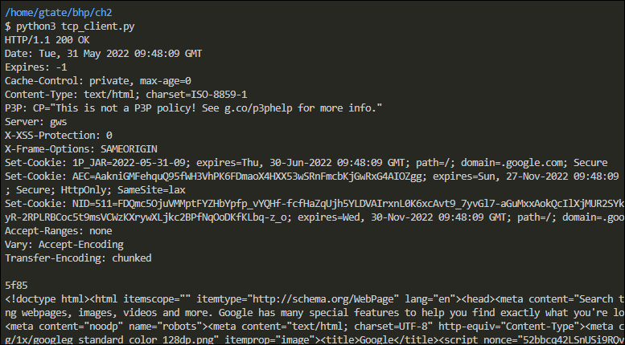

# Black Hat Python - Chapter 2

## Overview
When you are attacking a network, you may find that you don't have access to tools, like Wireshark, netcat, and a compiler.  However, in many cases Python will be installed, so that's where the value of knowing Python comes into play.

In this chapter, I will create clients, servers, and a TCP proxy.  I'll also create my very own netcat implementation, complete with a command shell.

This chapter is the foundation for subsequent chapters, in which I'll build a host discovery tool, implement cross-platform sniffers, and create a remote trojan framework!

This chapter uses the socket module.
- https://docs.python.org/3/library/socket.html
- https://docs.python.org/3/howto/sockets.html#socket-howto

This is the core module for all third-party tools and is all you really need for breaking in and maintaining access to target machines.

## A Simple TCP Client
<details>
  <summary>Basic script to set up a TCP client for testing web services</summary>

The ability to quickly create a TCP client comes in handy because many times you may not have access to tools or even the Internet.

The script [**tcp_client.py**](tcp_client.py) is an example of how to use the [socket](https://docs.python.org/3/library/socket.html) module to send and receive data from a host using a TCP connection.

There are a couple of assumptions this script makes:
1. The connection will always succeed
2. The server expects us to send some data first (some servers expect to send data to you first)
3. The server will always return data to us in a timely fashion

Here's the code:

```
# This script creates a quick TCP client

import socket

target_host = 'www.google.com'
target_port = 80

# create socket object
client = socket.socket(socket.AF_INET, socket.SOCK_STREAM)

# connect the client
client.connect((target_host, target_port))

# send some data
client.send(b"GET / HTTP/1.1\r\nHost: google.com\r\n\r\n")

# receive some data
response = client.recv(4096)

print(response.decode())
client.close()
```

Here is an example of the output:



### Script Details 
1. When initializing a socket object, you specify two required parameters, the socket family and the socket type. Both of these parameters are defined by constants, `AF_INET` and `SOCK_STREAM`. The constant `AF_INET` indicates the TCP client will use IPv4, and the constant `SOCK_STREAM` indicates the client will use a TCP connection.  
[](https://docs.python.org/3/library/socket.html#functions)

2. When calling the `Connect()` method on a socket object, you specify a tuple in the form of `(address, port)`, as in `socket.connect((address, port))`.
[](https://docs.python.org/3/library/socket.html#socket-objects)


3. When sending data, you use the method `socket.send()`.

In this example, the script sends the following data: `client.send(b"GET / HTTP/1.1\r\nHost: google.com\r\n\r\n")`. Let's break this down:
    - Per the reference above, the parameter for `send()` must be specified as a bytes object type
    - The Python documentation for [Bytes Objects](https://docs.python.org/3/library/stdtypes.html#bytes-objects) indicates the syntax for byte literals is `b<string>`, where string can be enclosed in single or double quotes
    - The contents of the byte string are provided in accordance w/ [RFC 7230 - HTTP/1.1 Message Syntax and Routing](https://datatracker.ietf.org/doc/html/rfc7230) and [RFC 3986 - URL General Syntax](https://datatracker.ietf.org/doc/html/rfc3986). To end lines in an HTTP request you have to use the `\r` (carriage return) and the `\n` (newline) characters.

4. When receiving data, you use the method `socket.recv()`. The value supplied, 4096, is typical for the use case. The return value is a bytes object.  


5. To view the HTTP response, you convert the bytes object using the `decode()` method, see [here](https://docs.python.org/3/library/stdtypes.html#bytes.decode).

6. The final step is to mark the socket as closed using the `close()` method. 


</details>

## A Simple UDP Client
A Python UDP client is very similar to the TCP client. 

Here's the code:

```
import socket

target_host = "127.0.0.1"
target_port = 9997

# create a socket object
client = socket.socket(socket.AF_INET, socket.SOCK_DGRAM)

# send some data
client.sendto(b'AAABBBCCC', (target_host, target_port))

# receive some data
data, addr = client.recvfrom(4096)

print(data.decode())

client.close()
```

When executing the script, the data doesn't return anything initially.

After installing Wireshark and running a capture on the loopback interface, you can confirm that data is being sent:

