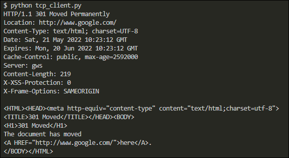

# Black Hat Python - Chapter 2

**Overview**  
When you are attacking a network, you may find that you don't have access to tools, like Wireshark, netcat, and a compiler.  However, in many cases Python will be installed, so that's where the value of knowing Python comes into play.

In this chapter, I will create clients, servers, and a TCP proxy.  I'll also create my very own netcat implementation, complete with a command shell.

This chapter is the foundation for subsequent chapters, in which I'll build a host discovery tool, implement cross-platform sniffers, and create a remote trojan framework!

This chapter uses the socket module.
- [https://docs.python.org/3/library/socket.html](https://docs.python.org/3/library/socket.html)

This is the core module for all third-party tools and is all you really need for breaking in and maintaining access to target machines

**TCP Client**  
The script [**tcp_client.py**](tcp_client.py) is an example of using the [socket](https://docs.python.org/3/library/socket.html) module to send and receive data from a host.

There are a couple of assumptions this script makes:
1. The connection will always succeed
2. The server expects us to send some data first (some servers expect to send data to you first)
3. The server will always return data to us in a timely fashion

Here is an example of what the script returns:

